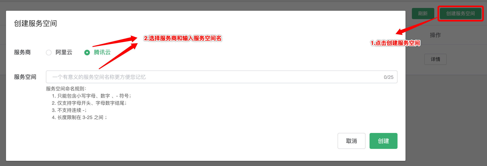

# 腾讯云验证码（CAPTCHA）插件

## 1. 插件介绍

| 标题        | 名称                                                                   |
| ----------- | ---------------------------------------------------------------------- |
| 中文名称    | 腾讯云验证码插件                                                       |
| 英文名称    | tencentcloud-plugin-captcha                                            |
| 最新版本    | v1.0.0 (2020.07.15)                                                    |
| 适用平台    | [DCloud uni-app](https://uniapp.dcloud.net.cn)                         |
| 适用产品    | [腾讯云验证码](https://cloud.tencent.com/product/captcha)              |
| GitHub 项目 | [tencentcloud-uniapp-plugin-captcha](https://github.com/Tencent-Cloud-Plugins/tencentcloud-uniapp-plugin-captcha)   |
| 主创团队    | 腾讯云中小企业产品中心（SMB Product Center of Tencent Cloud）          |

一款帮助开发者在 uni-app 项目开发中快捷使用腾讯云验证码产品功能的插件。

## 2. 功能特性

- 支持印刷体、手写体及定制化场景的图片文字识别服务，有效提升信息录入效率

## 3. 安装指引

本插件需要调用 uniCloud 云函数，而使用云函数的前提是：

- 使用 DCloud 官方开发工具 HBuilderX 2.7+；
- 已注册 DCloud 开发者账号并通过实名认证；
- 开通了 uniCloud 并创建一个腾讯云的服务空间；

### 3.1. 新建或打开已有项目

1. 打开 HBuilderX 开发工具；
1. 新建或打开一个 uni-app 项目；

### 3.2. 导入云函数

1. 访问 DCloud 插件市场的 [腾讯云插件 - 云函数模板](https://ext.dcloud.net.cn/plugin?id=2139) 详情页；
2. 点击详情页右上角 **使用 HBuilderX 导入插件**，将云函数模板导入到您的项目中；

3. 在项目中打开 _cloudfunctions/tencentcloud-plugin/config.js_ 文件，将腾讯云的密钥信息配置进去，可以在腾讯云 [API 密钥管理](https://console.cloud.tencent.com/cam/capi) 中获取 SecretId、SecretKey 和 APPID；

4. 在[uniCloud控制台](https://unicloud.dcloud.net.cn/login)注册HBuild账号并登录，创建[云服务空间](https://uniapp.dcloud.net.cn/uniCloud/concepts/space)；

5. 绑定云函数的云服务空间，将[云函数](https://uniapp.dcloud.net.cn/uniCloud/concepts/cloudfunction) [**上传部署**](https://uniapp.dcloud.net.cn/uniCloud/quickstart?id=rundebug) 到您的[云服务空间](https://uniapp.dcloud.net.cn/uniCloud/concepts/space)；


> 如果您之前在使用其它腾讯云产品的 uni-app 插件时已经导入过此云函数模板，则前 4 个步骤可以省略。

> 若导入失败或有其它疑问，请查看 [uniCloud 帮助文档](https://uniapp.dcloud.io/uniCloud/README) 云函数相关章节。

### 3.3. 导入插件

1. 访问 DCloud 插件市场 [腾讯云验证码（CAPTCHA）插件](https://ext.dcloud.net.cn/plugin?id=2519) 详情页；
1. 点击详情页右上角 **使用 HBuilderX 导入插件** ，将插件导入到您的项目中；
1. 在项目中通过 import 语法将插件提供的方法导入到相关业务组件并使用；

> 本插件的默认导入位置是在您项目的“js_sdk”目录下

## 4. 使用指引

### 4.1. 插件 API 导图


### 4.2. 插件 API 列表

| API 名称           | API 对应方法名        |
| ------------------ | --------------------- |
| 创建验证码实例     | captchaCreater        |
| 核查验证码票据结果 | describeCaptchaResult |

### 4.3. 插件使用示例

```javascript
// 验证码插件示例
import {
  captchaCreater,
  describeCaptchaResult,
} from "@/js_sdk/tencentcloud-plugin-capcha";

export default {
  methods: {
    // 触发验证码
    showCaptcha: async function() {
      try {
        uni.showLoading({
          mask: true,
        });
        // 创建验证码实例
        const captcha = await captchaCreater((res) => {
          this.result = res;
        });
        // 显示验证码
        captcha.show();
      } catch (error) {
        throw new Error(error);
      } finally {
        uni.hideLoading();
      }
    },
    // 校验验证码是否成功
    checkCaptcha: async function() {
      try {
        uni.showLoading({
          mask: true,
        });
        // 进行验证码校验
        const captcha = await describeCaptchaResult({
          captchaType: 9,
          ticket: this.result.ticket,
          randstr: this.result.randstr,
        });
        // 得到验证码校验结果
        this.checkResult = captcha.result;
      } catch (error) {
        throw new Error(error);
      } finally {
        uni.hideLoading();
      }
    },
  },
};
```

### 4.4. 名词解释

服务空间：一个服务空间对应一整套独立的云开发资源，包括数据库、存储空间、云函数等资源。服务空间之间彼此隔离。更多详情请访问 [uniCloud 开发文档](https://uniapp.dcloud.io/uniCloud/concepts/space)

云函数：云函数是运行在云端的 JavaScript 代码，更多详情请见 [uniCloud 云函数文档](https://uniapp.dcloud.io/uniCloud/cf-functions)

## 5. 获取入口

| 插件入口        | 链接 |
| --------------- | ---- |
| DCloud 插件市场 | [腾讯云验证码（CAPTCHA）插件](https://ext.dcloud.net.cn/plugin?id=2519) |

## 6. GitHub 版本迭代记录

### 6.1. tencentcloud-uniapp-plugin-captcha v1.0.0

- 完成验证码唤醒和结果校验功能

## 7. 联系我们

&nbsp;&nbsp;&nbsp;扫码备注“春雨”来联络到我们</br>


